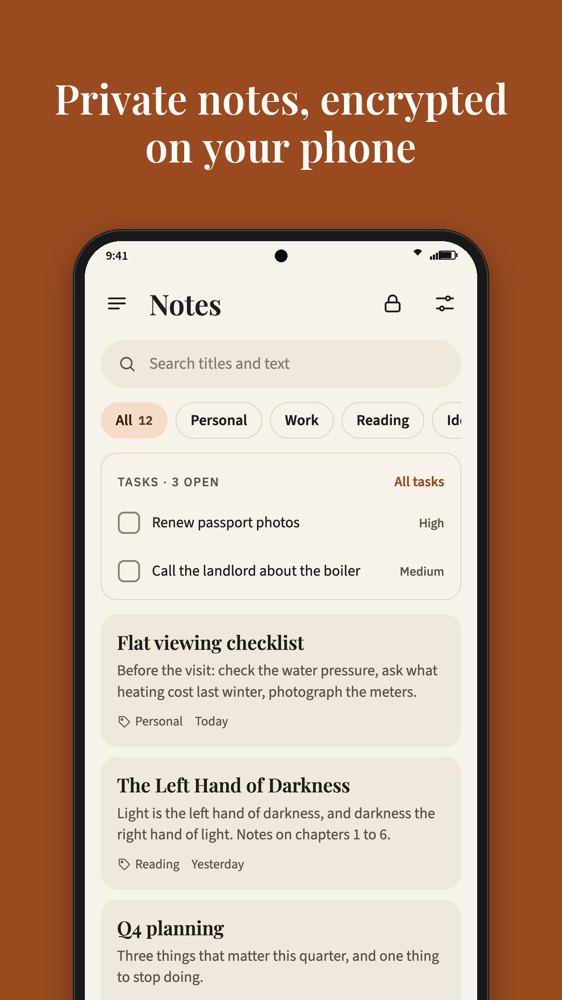
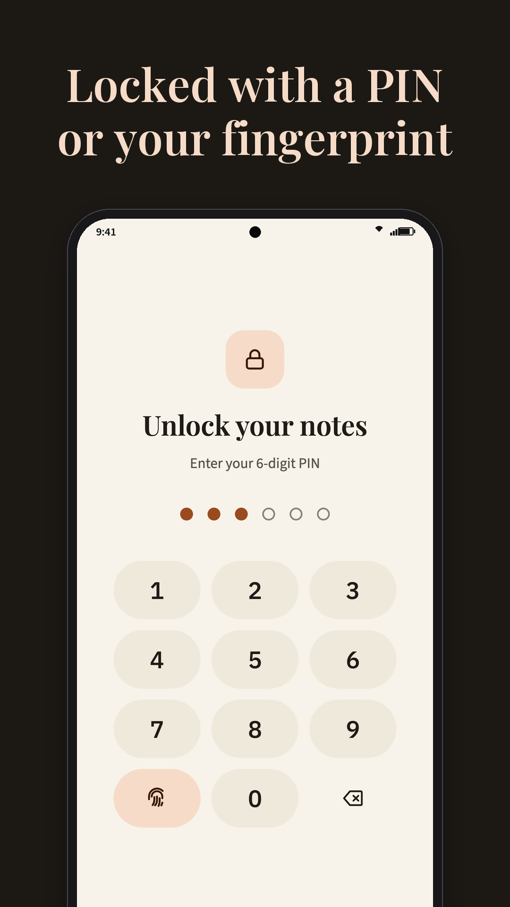
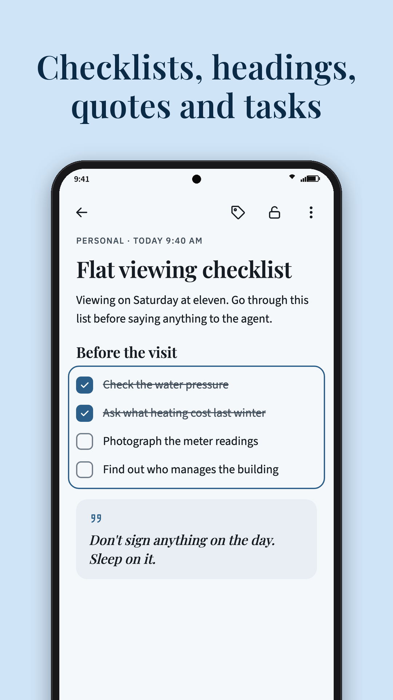
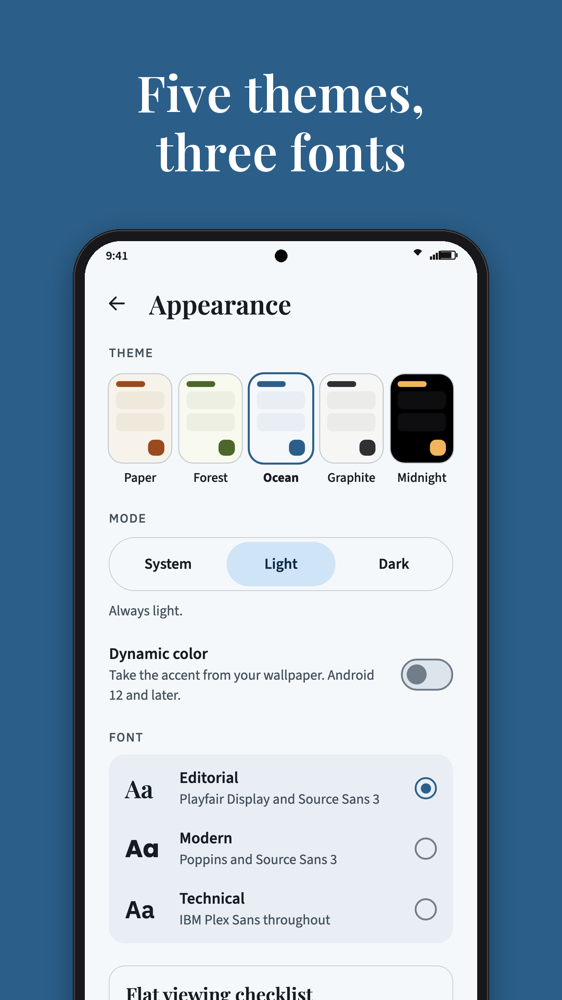

# Encly

[](https://github.com/pasichDev/Encly/actions/workflows/android.yml)
[](LICENSE)

**Offline encrypted notes and tasks for Android.**

Encly keeps notes and tasks encrypted on-device. There is no account, sync, telemetry,
notification pipeline, plaintext sharing flow, or network access. Access is protected by
a mandatory app PIN and, optionally, strong biometrics.

## Features

- 🔒 **Encrypted at rest** — Room on SQLCipher with a random 256-bit database key.
- 🧩 **Block editor** — text, headings, quotes, checklists / numbered lists, links, separators.
- 🏷️ **Tags & tasks** — local organization: tags for notes, tasks with priorities.
- 🗑️ **Trash** — soft-delete with restore.
- 🔑 **Optional BIP39 recovery seed** — a separate recovery slot for the database key.
- 📴 **Fully offline** — no `INTERNET` permission, cloud sync, analytics or downloadable fonts
  (editor fonts are bundled). The only links out (privacy policy, issue tracker, email, a note's
  link block and, in the Play build, the store page or, in the F-Droid build, the Ko-fi page)
  open in another app and only when you tap them.
- 🔐 **Mandatory lock** — 6-digit PIN plus optional Class 3 biometric unlock.
- 🛡️ **Protected UI** — `FLAG_SECURE` is enforced from the first Activity frame.
- 🌍 **9 languages** — pick one in Settings → Language, independently of the system language.

## Languages

English (default), Українська, Deutsch, Français, Español, Italiano, Polski, Português and
Nederlands.

Encly follows the device language when it is one of these, and falls back to English otherwise.
To use a different language for Encly only, open **Settings → Language** and pick it, or pick
**System default** to follow the device again. The choice applies immediately; on Android 13+
it also appears in the system's per-app language settings.

Found a wrong or clumsy translation, or want to add a language? See
[CONTRIBUTING.md → Translations](CONTRIBUTING.md#translations).

## Screenshots

<p>
  
  
  
  
</p>

All eight, with captions in every store language, are in
[`fastlane/metadata/android`](fastlane/metadata/android) (`<locale>/images/phoneScreenshots`).

## Install

[](https://github.com/pasichDev/Encly/releases/latest)
&nbsp;
&nbsp;

| Channel | Status | What you get |
|---|---|---|
| **GitHub Releases** | available | `Encly-<version>-fdroid.apk` (no Google Play links) or `Encly-<version>-play.apk` from [Releases](https://github.com/pasichDev/Encly/releases); verify it (below) before installing. |
| **Obtainium** | available | Add `https://github.com/pasichDev/Encly` as the source and filter APKs with `fdroid` to get updates straight from GitHub Releases. |
| **Google Play** | coming soon | The `play` flavor. |
| **F-Droid** | coming soon | The `fdroid` flavor, built by F-Droid from source. |

All channels use the same application ID and are meant to be signed with the same certificate,
so one can update another. If Android refuses such an update, do **not** uninstall without an
exported backup: uninstalling deletes the vault.

Requires Android 8.0 (API 26) or newer. Google Play Services are not needed.

## Verify a release

Every release ships a `SHA256SUMS` file (and `SHA256SUMS.asc` when it is GPG-signed).

```bash
sha256sum -c --ignore-missing SHA256SUMS          # APK matches the published checksum
apksigner verify --print-certs Encly-2.0.0-fdroid.apk
```

`apksigner` (Android SDK build-tools) must print this release signing certificate SHA-256
digest:

```text
6884c693354964276231e6d0336b965f690bf3f15a0707bb59505c208e5e7554
```

Any other certificate means the APK is not an official Encly build.

The release workflow refuses to publish an APK that is not signed with this certificate.

## Coming from 1.x

2.0 uses a new storage format and does **not** migrate 1.x data. 1.x never had public users;
if you ran it yourself, uninstall it before installing 2.0.

## Security model

Encly v2 uses envelope encryption rather than deriving the SQLCipher key directly from
a seed or PIN:

1. Onboarding creates a random 256-bit **DEK** (data-encryption key).
2. SQLCipher is opened with that DEK.
3. The mandatory PIN is processed with **PBKDF2-HMAC-SHA256 (600k)** and a random salt,
   and mixed (HKDF) with an HMAC from a non-exportable **Android Keystore** key (StrongBox
   when the phone has one), so PIN guesses can only run on this device. The resulting KEK
   wraps the DEK using **AES-256-GCM**. Encly does not store a PIN hash.
4. If biometrics are enabled, the same DEK gets a second AES-GCM slot protected by an
   auth-per-use AndroidKeyStore key. Unwrapping requires
   `BiometricPrompt.CryptoObject` with `BIOMETRIC_STRONG`.
5. With a recovery phrase (offered during setup, or later in Settings → Security), a 12-word
   BIP39 seed derives a recovery KEK and wraps the same DEK in a separate AES-GCM recovery
   slot. The same words are the only key to encrypted backups.
6. After Encly leaves the screen (after the auto-lock delay in Settings → Security, 15 s by
   default, or at once when the screen turns off), SQLCipher is closed and Encly's in-memory
   DEK copy is zeroized. The next entry must unwrap the DEK again.

Skipping the recovery phrase leaves the vault with **no recovery seed** and no backups.
Losing the PIN in that case makes the encrypted database unrecoverable.

The app also disables Android backup/device transfer for protected data and has no
system notifications, plaintext note sharing, calendar export, or seed export; the only
thing it copies to the clipboard is a link block's address, on request and marked sensitive. The one way data leaves the phone is an **encrypted backup**
you export yourself (Settings → Backup): it is sealed with your 12-word recovery phrase, and
the same words restore it on a new phone ("Restore from backup" in onboarding).

See [SECURITY.md](SECURITY.md) for the threat model and reporting process, and the
[privacy policy](https://pasichdev.xyz/apps/encly/privacy-policy/) (also in
[PRIVACY.md](PRIVACY.md)).

## Tech stack

Kotlin · Jetpack Compose · Material 3 · Hilt · Room · SQLCipher · Coroutines ·
kotlinx.serialization · BIP39 (kotlin-bip39)

Clean architecture: `presentation` → `domain` → `data`, with `core/security`
coordinating the v2 key vault.

## Build

Requirements:

- **JDK 21** (Android Studio's bundled JBR works).
- **Android SDK** with `platforms;android-36` and `build-tools;36.0.0` (AGP installs missing
  build-tools on first build if the SDK directory is writable).

Tell Gradle where the SDK is, either through the environment:

```bash
export ANDROID_HOME="$HOME/Library/Android/sdk"     # macOS default
# export ANDROID_HOME="$HOME/Android/Sdk"           # Linux default
```

or through an untracked `local.properties` at the repo root (Android Studio writes it for you):

```bash
echo "sdk.dir=$HOME/Library/Android/sdk" > local.properties
```

Without one of these the build stops with `SDK location not found`. To install the packages
from the command line: `sdkmanager "platforms;android-36" "build-tools;36.0.0"`.

The app has two distribution flavors with the same application ID: `fdroid` (no Google Play
links, no baseline profile) and `play`.

```bash
./gradlew assembleFdroidDebug                      # debug APK (com.pasich.encly.debug)
./gradlew :app:testFdroidDebugUnitTest             # JVM unit tests
./gradlew :app:koverVerifyFdroidDebug              # coverage gate for core/security
./gradlew :app:detekt :app:lintFdroidRelease       # static analysis
./gradlew spotlessApply                            # format Kotlin/Gradle (ktlint; spotlessCheck in CI)
./gradlew assembleRelease                          # both release APKs, R8 enabled
./gradlew :app:bundlePlayRelease                   # Google Play App Bundle (play flavor)
./gradlew :app:connectedFdroidDebugAndroidTest     # instrumented tests (emulator; wipes the debug app's data)
```

Outputs: `app/build/outputs/apk/<flavor>/<buildType>/`, and the bundle in
`app/build/outputs/bundle/playRelease/`. Releasing: [CONTRIBUTING.md → Releasing](CONTRIBUTING.md#releasing).

### Release signing for local builds (optional)

Local release builds are unsigned unless all four signing values are provided, either as
environment variables:

```bash
export ENCLY_KEYSTORE_PATH=/path/to/release.jks
export ENCLY_KEYSTORE_PASSWORD=…
export ENCLY_KEY_ALIAS=…
export ENCLY_KEY_PASSWORD=…
```

or in an untracked `keystore.properties` at the repo root (environment variables win):

```
storeFile=/path/to/keystore.jks
storePassword=…
keyAlias=…
keyPassword=…
```

Keystores and `keystore.properties` are git-ignored; never commit them.

CI does not use these: the release workflows build unsigned and sign the APKs and the bundle
with `apksigner` / `jarsigner` in a separate step, so Gradle never sees the keystore.

### Versioning and releases

`version.properties` is the single source of the version: `versionName = MAJOR.MINOR.PATCH`,
`versionCode = MAJOR*10000 + MINOR*100 + PATCH`. Pushing a tag `vMAJOR.MINOR.PATCH` that matches
it runs [`release.yml`](.github/workflows/release.yml), which builds, signs, checks the signing
certificate, and publishes the APKs, `SHA256SUMS` and R8 mapping files as a GitHub Release. The
run fails, rather than publishing unsigned APKs, when the signing secrets are missing.
See [CONTRIBUTING.md](CONTRIBUTING.md#releasing).

## Documentation

- [Privacy policy](https://pasichdev.xyz/apps/encly/privacy-policy/) ([PRIVACY.md](PRIVACY.md))
- [Security model](SECURITY.md)
- [Changelog](CHANGELOG.md)
- [Architecture](docs/architecture.md)

## Contributing

Issues and PRs are welcome — see [CONTRIBUTING.md](CONTRIBUTING.md) and the
[Code of Conduct](CODE_OF_CONDUCT.md). Report vulnerabilities privately as described in
[SECURITY.md](SECURITY.md#reporting-a-vulnerability), not in public issues.

## License

[Apache License 2.0](LICENSE). Bundled fonts are under the SIL Open Font License 1.1; see
[`licenses/fonts`](licenses/fonts).
