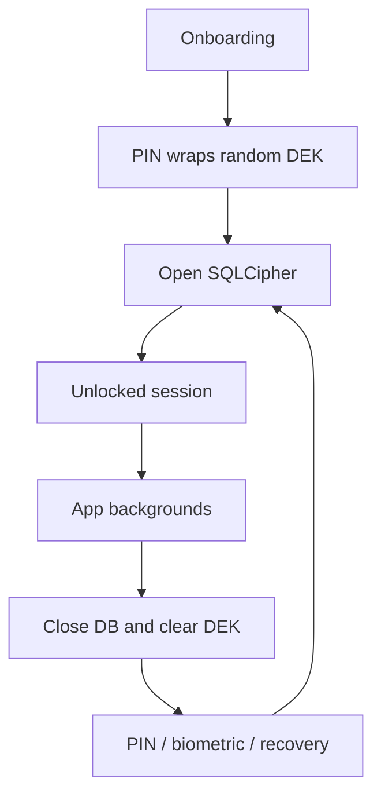
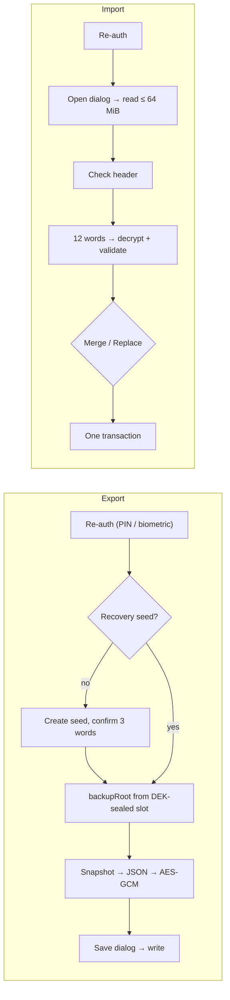

# Architecture

Encly is a local-first Android application. Its runtime direction is:

```
presentation → domain/use cases → repositories → local data source → Room/SQLCipher
```

The presentation layer contains Compose screens and Hilt ViewModels. It renders state and sends
user intent; persistence and security decisions remain outside Composables.

## Layers

- **Presentation** — navigation, screens, reusable UI and ViewModels.
- **Domain** — use cases plus repository contracts. ViewModels use these contracts for feature
  operations such as saving a note, moving it to trash or changing a task.
- **Data** — Room entities/DAOs, repository implementations and the local data-source facade.
- **Core security** — vault setup/unlock, session lock, biometric slot, recovery slot and the
  SQLCipher database lifecycle.
- **Backup** — encrypted export/import (`core/backup`, `data/backup`), described below.

## Vault and session lifecycle



A fresh vault generates a random 256-bit DEK. SQLCipher uses the DEK; the mandatory PIN,
optional auth-bound biometric key and optional recovery seed each protect a separate AES-GCM
envelope of that same DEK. No UI layer derives or stores the database key directly.

`SecureDatabaseManager` owns the active Room instance. Repositories resolve DAOs through
`DatabaseLocalDataSource` at operation time, rather than retaining an old DAO after the
database is closed on re-lock.

## Notes and tasks

Note editor writes are serialized by its ViewModel and must complete before navigation reports
success. Notes, tags and tasks remain local Room records inside the encrypted database. Room
Flows drive list state; the active note list is derived from selected tag and sort state.

## Navigation

Startup resolves vault state before rendering the main graph. Locked sessions route to the lock
screen, which consumes Back navigation. A background re-lock clears protected destinations so a
fresh unlock starts with new database-backed ViewModels. Until the lock screen is the only
visible destination, an opaque shield covers the previous screen, so the first frame after
returning never shows plaintext. An unlock that completes after the app left the foreground is
closed again at once. Open task and tag editors save on pause, like the note editor, because the
re-lock discards them.

## Encrypted backups

Export/import is fully offline: the UI hands whole files to and from the Storage Access
Framework (`CreateDocument` / `OpenDocument`), so there is no storage permission, no temp file
and no network code. The key comes from the BIP39 recovery seed (see
[SECURITY.md](../SECURITY.md#encrypted-backups)), so the same 12 words open a backup on a new
phone.

| Piece | Role |
|---|---|
| `core/backup/BackupFormat` | Container layout, header encode/parse, structural errors |
| `core/backup/BackupKeys` | Seed normalization, `backupRoot` and per-file key (HKDF-SHA256) |
| `core/backup/BackupCipher` | AES-256-GCM seal/open with the header as AAD |
| `core/backup/BackupPayload` | Plaintext model + strict JSON codec and validation |
| `data/backup/BackupManager` | Export (snapshot → seal), decrypt, import, last-export time |
| `data/backup/BackupImporter` | Merge/replace in one transaction, links remapped by uid |
| `data/backup/VaultDataStore` | Narrow storage contract; `RoomVaultDataStore` over `BackupDao` |
| `data/backup/BackupPhraseSetup` | Recovery seed + backup-key slot needed before an export |
| `data/backup/PendingRestore` | Onboarding restore held in memory until PIN setup opens the vault |
| `data/backup/BackupDocuments` | Reads (≤ 64 MiB, buffer sized from the header) and writes the picked document; never overwrites an existing one |
| `presentation/.../BackupViewModel` + `BackupFlows` | Re-auth, export, import and seed-setup steps |



Onboarding offers "Restore from backup" next to the two vault types: it decrypts and validates
the file with the typed words, creates the vault with those words as its recovery seed, and
`AuthSetupViewModel` writes the backup (replace, into the empty vault) right after the PIN setup
opens the database and before onboarding is committed (`SecurityManager.openInitialVault` →
`PendingRestore.apply` → `commitInitialSetup`). A failed import commits nothing: the user retries
or continues with an empty vault.

### File format (version 1)

A small binary envelope; all integers are unsigned big-endian. The 61 header bytes are the
AES-GCM additional authenticated data, so changing any header field fails authentication.

| Offset | Size | Field |
|---:|---:|---|
| 0 | 8 | magic `ENCLYBAK` (ASCII) |
| 8 | 2 | format version = 1 |
| 10 | 1 | KDF id: 1 = HKDF-SHA256 from the recovery phrase |
| 11 | 1 | salt length = 32 |
| 12 | 32 | HKDF salt, random per file |
| 44 | 1 | nonce length = 12 |
| 45 | 12 | AES-256-GCM nonce, random per file |
| 57 | 4 | ciphertext length N, including the 16-byte tag |
| 61 | N | AES-256-GCM(fileKey, nonce, AAD = bytes 0–60) of the UTF-8 JSON payload, then the tag |

Nothing may follow the ciphertext. Readers reject, before asking for the words: a wrong magic
(`NOT_A_BACKUP`), another format version (`UNSUPPORTED_VERSION`), a short file (`TRUNCATED`),
unknown KDF, wrong field lengths or trailing bytes (`CORRUPTED`), and files over 64 MiB
(`TOO_LARGE`). Export enforces the same 64 MiB limit, so it never writes a file import would
refuse. A wrong phrase or any modified byte fails GCM (`WRONG_SECRET`); an authentic payload
with a newer `schema` is `UNSUPPORTED_VERSION` ("update the app"), and one that does not
validate is `INVALID_PAYLOAD`.

The payload (`schema` = 2) is:

```json
{
  "schema": 2,
  "exportedAt": 1758620000000,
  "tags":  [{ "uid": "…", "name": "…", "visible": true, "position": 0 }],
  "notes": [{ "uid": "…", "title": "…", "value": "<serialized blocks>", "description": "…",
              "date": 0, "dateCreate": 0, "tagUid": "…|null", "isTrash": false }],
  "tasks": [{ "uid": "…", "title": "…", "description": "…|null", "isCompleted": false,
              "createdDate": 0, "completedDate": null, "priority": 0,
              "categoryTagUid": "…|null", "position": 0 }]
}
```

Unknown keys are rejected rather than ignored, so **every** payload change, even an optional
field, must bump `BackupPayload.SCHEMA_VERSION`: the schema is read first, and an older app then
reports the file as unsupported instead of damaged. Older schemas stay readable:
`BackupPayloadCodec.decode` upgrades them before the strict decode (schema 1 tasks carried a
`reminderDate`, which is dropped).

Every note, tag and task row has a unique, never-blank `uid` column (database version 2;
version 3 dropped `tasks.reminderDate`); two triggers in `VaultSchema` fill a blank uid on
insert and keep it on update, so app code never has to assign one.

For implementation details and limits, see [SECURITY.md](../SECURITY.md).
