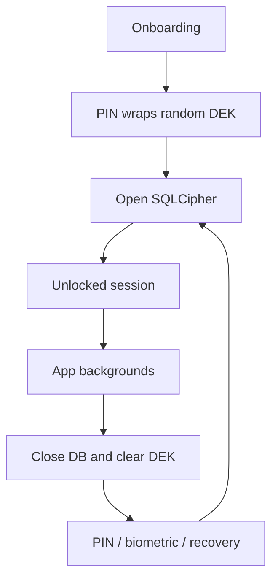

# Architecture

Encly is a local-first Android application. Its runtime direction is:

```
presentation → domain/use cases → repositories → local data source → Room/SQLCipher
```

The presentation layer contains Compose screens and Hilt ViewModels. It renders state and sends
user intent; persistence and security decisions remain outside Composables.

## Layers

- **Presentation** — navigation, screens, reusable UI and ViewModels.
- **Domain** — use cases plus repository contracts. ViewModels use these contracts for feature
  operations such as saving a note, moving it to trash or changing a task.
- **Data** — Room entities/DAOs, repository implementations and the local data-source facade.
- **Core security** — vault setup/unlock, session lock, biometric slot, recovery slot and the
  SQLCipher database lifecycle.

## Vault and session lifecycle



A fresh vault generates a random 256-bit DEK. SQLCipher uses the DEK; the mandatory PIN,
optional auth-bound biometric key and optional recovery seed each protect a separate AES-GCM
envelope of that same DEK. No UI layer derives or stores the database key directly.

`SecureDatabaseManager` owns the active Room instance. Repositories resolve DAOs through
`DatabaseLocalDataSource` at operation time, rather than retaining an old DAO after the
database is closed on re-lock.

## Notes and tasks

Note editor writes are serialized by its ViewModel and must complete before navigation reports
success. Notes, tags and tasks remain local Room records inside the encrypted database. Room
Flows drive list state; the active note list is derived from selected tag and sort state.

## Navigation

Startup resolves vault state before rendering the main graph. Locked sessions route to the lock
screen, which consumes Back navigation. A background re-lock clears protected destinations so a
fresh unlock starts with new database-backed ViewModels.

For implementation details and limits, see [SECURITY.md](../SECURITY.md).
